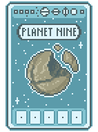
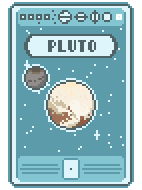
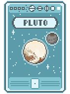

# Planet Nine

A mod for [Balatro](https://store.steampowered.com/app/2379780/Balatro/) that renames the Planet X card to Planet Nine

This mod uses [Malverk](https://github.com/Eremel/Malverk) to let the user choose which textures to use

## Features

All of the following textures are optional, they can be configured from **Malverk**'s *Textures* menu. Click on the "Planet Nine" texture pack, hit apply, then click on it again and hit the settings button. The tables below show which textures are enabled/disabled by default.

### Planet Nine

| Planet Nine - Retexture | Planet Nine - Name Only |
| ------------- | ------------- |
|  |  |
| Enabled | Disabled |

Selecting either of these will rename the Planet X card to Planet Nine. The card name is localized for every available language.

### Pluto & Charon

| Pluto & Charon - Left Variant | Pluto & Charon - Right Variant |
| ------------- | ------------- |
|  |  |
| Enabled | Disabled |

Adds Pluto's largest moon Charon to the card design.

The card name is not changed.

Left/right preference is up to the user, but the other cards have their moons on the left. The right variant is ideally for if the original Planet X texture is kept, as it may "balance" the designs.

## Installation

1. Install [Steamodded](https://github.com/Steamodded/smods)

2. Install [Malverk](https://github.com/Eremel/Malverk)

3. Download this mod's zip file from the [latest release](https://github.com/DarkAutumn2618/balatro-planetnine/releases)

4. Open the zip file and place the **planetnine** folder into the Balatro mods folder

## Author's Notes

### Motivation

The [original Planet X hypothesis](https://en.wikipedia.org/wiki/Planets_beyond_Neptune#Planet_X) was specifically about unexplained effects on Uranus and Neptune, effects that were found to [no longer exist](https://en.wikipedia.org/wiki/Planets_beyond_Neptune#Planet_X_disproved). Personally, the name "Planet X" sounds too outdated or sci-fi. What's more interesting is the [Planet Nine hypothesis](https://en.wikipedia.org/wiki/Planet_Nine), because it's a part of current events. Basically it's the 21st century version of Planet X. The [wiki](https://balatrogame.fandom.com/wiki/Planet_Cards#Trivia) even references a [NASA article](https://science.nasa.gov/solar-system/planet-x/) for Planet X (though it infuriatingly conflates the two names).

And if Eris has its moon Dysnomia on its card, then Pluto should have Charon as well :)

### Localization

I tried my best to translate "Planet Nine" into every language. Specifically those words, not "ninth planet" or "planet 9" as it's the proper name of the hypothesis.
